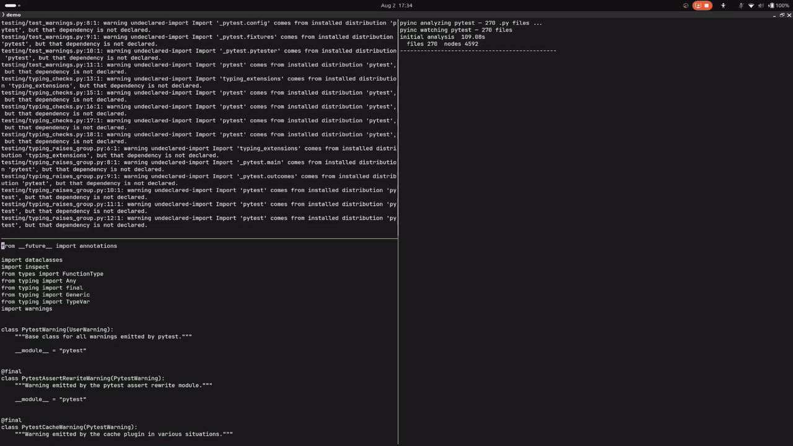

# Demo — pyinc on a Real Workspace

This page records one run of `pyinc-tools` against a workspace nobody wrote for
`pyinc`: a pinned checkout of pytest. It shows what the watcher does, what a
single edit costs, and which queries that edit actually re-ran.

Every figure below was measured against `pyinc` at commit `7256aaf` unless a
different commit is named. Wall-clock figures were measured on one machine
running alone. They will differ on yours and are diagnostics, not thresholds —
the same convention the [benchmark harness](../bench/README.md) uses. Of the
work counts — how many queries executed, how many results were reused, how many
were backdated — the executed and backdated counts are properties of the engine
and the edit rather than of the machine, and reproduce exactly. The reused count
is stable only to within run-to-run noise: two runs of the traced edit on the
same engine and the same machine reported 9,746 and 9,782 reused results, while
both reported 85 executed and 45 backdated.

## Watching a real workspace

The workspace is a checkout of pytest at
`56b196e921acec0259d84622a570fde6032e15b5`: 270 Python files across 76
directories, covering `src/_pytest`, the test suite, and the surrounding
tooling. Nothing in it is adapted for `pyinc`, and no configuration was added.

`pyinc-tools analyze <workspace> --watch` analyzes the tree once, then polls
for changes in a daemon thread. When changed files have settled for the
debounce window it re-requests the workspace analysis and prints that batch's
diagnostics. The re-request runs the same queries as the first one. What makes
it cheap is that evaluation is pull-based: `db.get()` verifies a node's
dependencies before deciding whether to execute it, so a query whose tracked
reads have not changed answers from its memo without running.



Two edits, back to back: a comment appended to the first line, which the engine
absorbs as backdates rather than cascading work, and then an unresolvable import
appended to the end of the same file, which surfaces as a new diagnostic. The
stats pane on the right reports each update as the watcher finishes it.

The recording is its own run of the engine, separate from the probe that
produced the tables below, so its wall-clock readings differ slightly from
theirs. Its work counts do not: the recorded updates report 73 executed / 47
backdated for the comment edit and 85 executed / 45 backdated for the broken
import, matching the probe exactly.

## How an update flows


The arrows follow the data. Evaluation runs the other way: a request starts at
the right and walks down, verifying before it executes.

- **Watched files.** The poller reports which paths changed. It is a trigger,
  not an authority — it decides when to ask, never what is stale.
- **Resource probes.** Every read of the tree inside a query goes through a
  `Resource`, so the read is tracked and the kernel owns the comparison. The
  source resource probes a file by the SHA-256 of its bytes, so a file that was
  touched but not changed re-probes to the same value and dirties nothing.
- **Per-file payload queries.** One file's text becomes cached tuple payloads:
  source ranges, definitions, import statements, syntax diagnostics, scope
  tree, module symbol table. These are the nodes whose dependency edges name
  the file's resource.
- **Composition queries.** Module- and workspace-level queries read other
  queries' payloads — import resolution, the workspace symbol index, dependency
  status. They do not re-read the filesystem themselves; composition happens at
  the cached query layer, so their edges land on the payload queries above.
- **Decoded result records.** The high-level entrypoints in
  [`pyinc.integrations`](integration-contract.md) decode those cached payloads
  into frozen result records. Consumers see records; the payload queries and
  decoding helpers are not part of that contract.

The [architecture overview](architecture.md) describes the node records and
decisions this pipeline is built from.

## What one update costs

Both columns below were measured against the same pinned workspace on the same
machine with the same probe, which tells the session which paths changed before
each re-analysis. The first column is an earlier build of the same engine
(`4b5f392`); the second is the current one (`7256aaf`).

| Operation | Earlier build (`4b5f392`) | Current (`7256aaf`) | Speedup |
|---|---|---|---|
| Initial workspace analysis | 232.99 s | 104.43 s | ~2.2x |
| Workspace re-analysis after a one-file edit | 160.311 s | 0.597 s | ~268x |
| Warm single-file re-analysis | 10.010 s | 0.209 s | ~48x |

The initial analysis is not incremental — there is nothing to reuse yet — which
is why it moves least. The other two rows are the incremental path. The one-file
edit in the middle row is an in-place comment change, which the section below
returns to.

The update traced in the next section is a separate capture against the current
engine. Its edit appends an unresolvable import to one file:

| Metric | Value |
|---|---|
| Update wall time | 0.613 s |
| Queries executed | 85 |
| Results reused | 9,782 |
| Results backdated | 45 |

## Tracing an update

The diagram below is the edited file's own re-derivation cascade, taken from the
engine's dependency graph after that update. Each node carries its **last
recorded decision** for that request — the value `Database.inspect(...)` reports
— colored red for `executed`, yellow for `backdated`, green for `reused`. Its
arrows run from a node to a dependency it read, the opposite of the data-flow
arrows in the diagram above.

```mermaid
graph LR
    %% This diagram shows only the changed file's own re-derivation cascade: 8 of the update's 85 executed queries. The rest are per-request entrypoint work elsewhere in the workspace (workspace- and module-level aggregation over files other than this one).
    %% n0-n14 are the file's own re-derivation cascade (BFS from its sourcefile resource, following "who depends on this"). The resolve_module_location nodes below are a separate, disconnected concern: other call sites elsewhere in the workspace that import this module by dotted name -- they depend on filesystem probes, not on this file's content, so they never join the cascade.
    %% 13 more resolve_module_location(_pytest.warning_types) node(s) elided (3 of 16 non-executed ones shown as a representative sample; breakdown of the non-executed ones: 16 reused); every executed node is shown.
    n0["sourcefile(src/_pytest/warning_types.py)"]:::exec
    n1["source_text(src/_pytest/warning_types.py)"]:::reuse
    n2["syntax_diagnostics_for_file(src/_pytest/warning_types.py)"]:::back
    n3["definitions_for_file(src/_pytest/warning_types.py)"]:::reuse
    n4["import_statements_for_file(src/_pytest/warning_types.py)"]:::reuse
    n5["module_binding_analysis_payload(src/_pytest/warning_types.py)"]:::reuse
    n6["source_ranges_for_file(src/_pytest/warning_types.py)"]:::exec
    n7["scope_tree_payload(src/_pytest/warning_types.py)"]:::exec
    n8["module_symbol_table_payload(src/_pytest/warning_types.py)"]:::exec
    n9["module_analysis_payload(src/_pytest/warning_types.py)"]:::exec
    n10["imports_for_file(src/_pytest/warning_types.py)"]:::reuse
    n11["resolved_imports_for_file(src/_pytest/warning_types.py)"]:::exec
    n12["module_symbol_table_for_module(src/_pytest/warning_types.py)"]:::reuse
    n13["workspace_analysis_payload(workspace)"]:::exec
    n14["workspace_symbol_index_payload(workspace)"]:::exec
    n15["resolve_module_location(_pytest.warning_types)"]:::reuse
    n16["resolve_module_location(_pytest.warning_types) #2"]:::reuse
    n17["resolve_module_location(_pytest.warning_types) #3"]:::reuse
    n1 --> n0
    n2 --> n0
    n3 --> n1
    n4 --> n1
    n5 --> n1
    n6 --> n1
    n7 --> n1
    n8 --> n1
    n9 --> n3
    n9 --> n10
    n9 --> n11
    n9 --> n2
    n10 --> n4
    n11 --> n4
    n12 --> n5
    n12 --> n8
    n13 --> n9
    n14 --> n12
    classDef exec fill:#fdd,stroke:#c33
    classDef back fill:#ffd,stroke:#ca3
    classDef reuse fill:#dfd,stroke:#3a3
```



Eight nodes recorded `executed`: the file's source resource, whose bytes hashed
to a new value, and then its source ranges, scope tree, module symbol table,
resolved imports, and module analysis payload, plus the two workspace-level
aggregates above them. One recorded `backdated` — the file's syntax diagnostics
re-ran and returned a result semantically equal to the one already recorded, so
it did not invalidate anything downstream. A node that consumes it may still
have re-executed, but not on its account. The remaining nine recorded `reused`,
the decision the kernel records when it verified a node's dependencies and the
memo stood.

Two things the diagram deliberately does not show. First, the
`resolve_module_location` nodes are a disconnected concern — other call sites in
the workspace that import this module by dotted name. They depend on filesystem
probes for candidate paths, not on this file's content, so they are never part
of the cascade. Thirteen more of them are elided; every executed node is shown.
Second, this is 8 of the update's 85 executed queries. The other 77 are
per-request entrypoint work elsewhere in the workspace — module- and
workspace-level aggregation over files other than the edited one — which one
file's cascade cannot honestly depict.

Any `pyinc` graph can be read this way: `Database.inspect(...)` returns the last
recorded provenance tree for a query key and `Database.explain(...)` formats it.
Inspection never changes a node's recorded decision.

## Why the formatting edit is the interesting one

The row that moves furthest above is not the one that adds an error. It is the
comment edit: a change to the file's bytes with no consequence for anything
derived from them. That edit dirties the file's tracked reads, so the queries
that read it are re-executed — but they return results semantically equal to the
ones already recorded, so those nodes are **backdated** rather than invalidated,
and nothing downstream re-runs on their account. It is the middle row of the
table above: 73 queries executed, 9,744 results reused, 47 backdated. The same
probe's no-change re-request — a re-analysis with nothing edited at all —
executed 73 queries too, so the comment edit cost no execution beyond the price
of asking the question again.

Backdating is why the correctness guarantee is affordable rather than merely
true. The [kernel contract](kernel-contract.md) guarantees **from-scratch
consistency**: incremental evaluation matches a fresh evaluation on the same
declared inputs and resources. That guarantee rests on
[three conditions](kernel-contract.md#conditions-for-from-scratch-consistency),
and the third one is what licenses the shortcut — a query that is deterministic
with respect to its tracked dependencies cannot have a semantically equal result
that means something different, so an equal recomputation is proof that
downstream work is still valid.

The same reasoning is what makes the 268x row a fair number rather than a lucky
one. The engine did not skip the edited file; it ran its queries and then
proved, result by result, that the rest of the workspace did not need to follow.

## Run this yourself

Watch a workspace and print diagnostics as text:

```console
pyinc-tools analyze /path/to/workspace --watch --format text
```

Each batch is introduced by a `# changed: <paths>` header followed by that
run's diagnostic lines, so headers can be filtered out with `grep -v '^#'`.
The watcher exits cleanly on Ctrl-C. Polling is stdlib-only and portable;
platform-specific push backends are not included.

The same analysis gates a CI job. `--fail-on` exits `3` when any diagnostic is
at or above the given severity, and the report is printed before the exit status
is decided, so a failing gate still says what failed:

```console
pyinc-tools analyze /path/to/workspace --format text --fail-on error
```

`--fail-on` cannot be combined with `--watch`, which never terminates normally.
The [tooling guide](pyinc-tools-guide.md) covers installation, overlays, output
shapes, and exit statuses in full.

Editors get the same results over stdio: `pyinc-tools lsp` serves the workspace
through the language server protocol. The [LSP reference](lsp-reference.md)
lists the advertised methods and their user-visible limitations, and the tooling
guide covers editor setup.

## Limitations

The numbers above are for one kind of work, and that work is deliberately
bounded. From the [integration contract](integration-contract.md):

- **Nothing is executed.** Imports are not run and dynamic exports are not
  inferred. Conditional or dynamically constructed bindings are reported
  conservatively, ambiguous module names remain ambiguous, and `.pth` import
  lines are recorded and diagnosed but never executed.
- **Resolution is static and conservative.** A position that is ambiguous,
  dynamic, or outside a resolvable workspace binding returns no symbol rather
  than a speculative target.
- **The live `sys.path` is untracked.** It is declared untracked and scanned
  again rather than treated as durable state. Zip imports, extension modules,
  legacy eggs, editable-install pointer formats, path hooks, and meta-path
  finders are not resolved.
- **This is not a type checker.** There is no runtime attribute inference, type
  evaluation, decorator semantics, installed-source navigation, or complete
  method-resolution-order model; inheritance is flattened nearest-definition-wins
  rather than by C3, so it can pick a different winner than the interpreter for a
  name defined at several points in a diamond.
