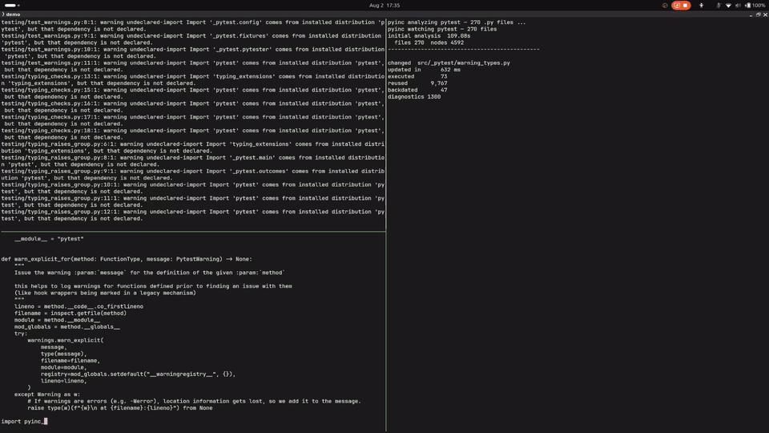

# Demo — pyinc on a Real Workspace

This page shows `pyinc-tools` running against a workspace nobody wrote for
`pyinc`: a checkout of pytest pinned at
`56b196e921acec0259d84622a570fde6032e15b5`, with nothing adapted for `pyinc` and
no configuration added.



The watcher analyzes the tree once, then re-analyzes when edited files settle.


Two edits back to back: a comment the engine absorbs as backdates, then an
unresolvable import that surfaces as a new diagnostic.

Point it at a tree of your own:

```console
pyinc-tools analyze /path/to/workspace --watch --format text
```

The [tooling guide](pyinc-tools-guide.md) covers installation, overlays, output
shapes, and exit statuses. What this analysis does and does not do — nothing is
executed, resolution is static and conservative, and it is not a type checker —
is stated in the [integration contract](integration-contract.md).
