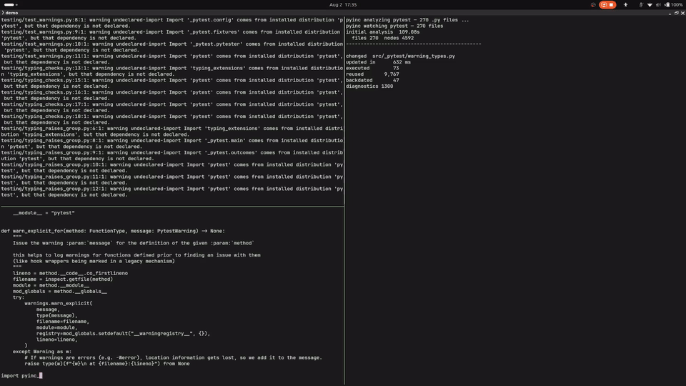
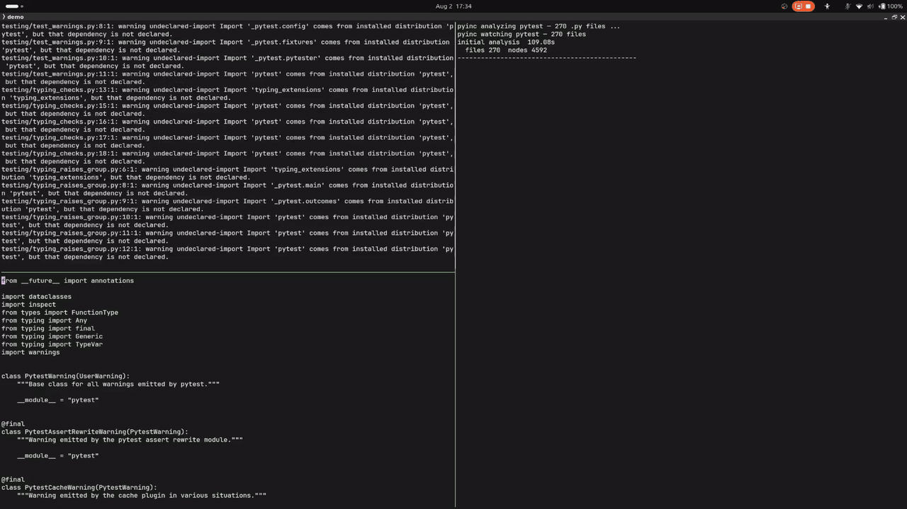

# Demo: pyinc on a Real Workspace

This page shows `pyinc-tools` running against a workspace written without
`pyinc` in mind: a checkout of pytest pinned at
`56b196e921acec0259d84622a570fde6032e15b5`. The checkout is used as is, with
no added configuration.



The watcher analyzes the tree once, then re-analyzes when edited files settle.
The stats pane shows both halves of that split. A cold analysis of all 270
files took 109.08 s. After one edit to `src/_pytest/warning_types.py`, bringing
the graph back up to date took 632 ms: 74 queries executed, 9,722 reused, and 52
backdated because recomputing them produced a semantically equal result. The
1,300 diagnostics are reported `undeclared-import` findings: imports of
installed distributions that pytest's own dependency metadata leaves
undeclared. The count is what the tool reported. Whether each finding is a
pytest defect is a separate question.



Two edits back to back: a comment the engine absorbs as backdates, then an
unresolvable import that surfaces as a new diagnostic.

## Provenance

The clips are a single live recording made as a demonstration: one take, one
run, no repetitions. The wall-clock figures above are what the stats pane
showed during that take. They are specific to the machine described below.
Treat them only as an illustration of the cold/warm split.

The three work counts come from a later measurement. They were re-measured
against the current build, on the same pinned workspace and the same one-line
edit, and they replace the figures the recorded take showed. The split between
executed and backdated work held steady across those measurements. The reuse
total varied. It tracks the size of the surrounding graph, which shifts from run
to run and with the packages installed alongside the workspace. Read all three
counts as an illustration of the split. Your own run may produce different
numbers.

- Workspace: pytest pinned at `56b196e921acec0259d84622a570fde6032e15b5`,
  270 `.py` files, no configuration added.
- Command: `pyinc-tools analyze . --watch --format text`, with edits made to
  `src/_pytest/warning_types.py` in a separate pane.
- "Cold" means a freshly started watcher process analyzing the tree for the
  first time, with no prior in-memory state and no durable checkpoint.
- Environment: the 3.1 release lineage of `pyinc`, CPython 3.14.4 on Linux,
  Intel Core 7 240H (16 CPUs), local ext4 disk, machine otherwise idle.

For controlled, repeated measurements, use the benchmark harness.
`python -m bench.run --output bench/results --repetitions 5` records the exact
commit, Python build, OS, CPU, and repetition metadata alongside its results
(see [bench/README.md](../bench/README.md)).

Point it at a tree of your own:

```console
pyinc-tools analyze /path/to/workspace --watch --format text
```

The [tooling guide](pyinc-tools-guide.md) covers installation, overlays, output
shapes, and exit statuses. The [integration contract](integration-contract.md)
states the scope of this analysis. It reads code without executing it, its
resolution is static and conservative, and it is not a type checker.
